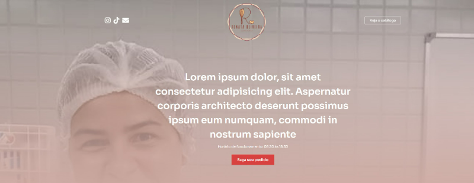
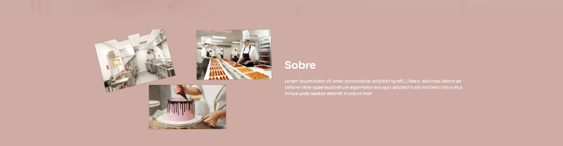
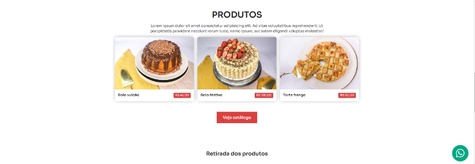
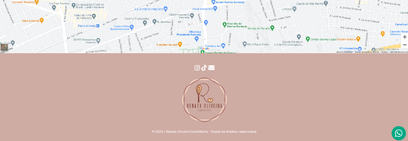

<h1 align="center">
  💻 Landing Page de Confeitaria
</h1>

# Sobre o projeto

Primeira versão de landing page profissional de confeitaria feito do zero e responsivo baseado em um desafio do Sujeito Programador.
Objetivo do projeto é composto por uma única página que visa transformar o seu visitante demonstrar interesse por seu produto ou serviço.

##  💼 Tecnologias usadas
<li>HTML5</li>
<li>CSS3</li>
<li>SASS</li>
<li>AOS (Biblioteca de animação)</li>

## 🎨 Imagem do Projeto

